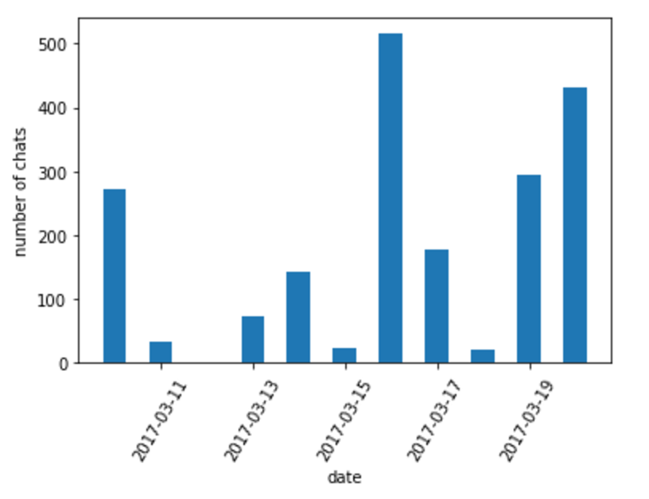
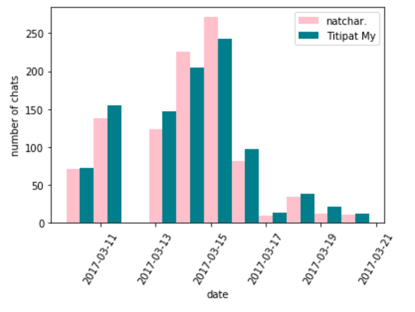

# Visualize LINE chat

In LINE chat, you can export activities and text from your previous
chat. Here, I create simple function (aim for teaching) to visualize
those activities.

First, we can read the history from `txt` file using the following fucntion

```python
import line_utils
chats_dict = line_utils.get_line_chat_dicts('chat_history.txt')
```

`chats_dict` is a chat dictionary which the following keys: `count`, `chats`, `total_chats`


**Plot chats activities on given day**

```python
line_utils.plot_chat_per_day(chats_dict)
```

<div align = 'left'>
  
</div>

**Plot chats activities per users on given day**

```python
line_utils.plot_chat_users_per_day(chats_dict, users=['user1', 'user2'])
```

Here `users` is a list of username strings in the chat

<div align = 'left'>
  
</div>

**Plot punch card activities**

To see at what time in week, you're chatting with your friends the most.

```python
line_utils.plot_punch_card_activities(chats_dict, users=['user1', 'user2'])

```
<div align = 'left'>
  
</div>
