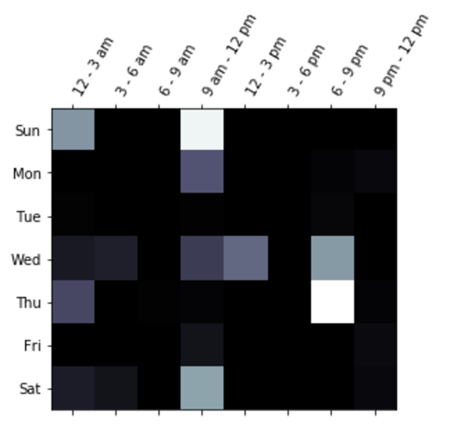

# Visualize LINE chat

In [LINE chat](https://line.me/en/) (very popular app chat for Asian folks),
we can read the history from exported text file (Save chat).
We can use the following function in order to read the chat history text file.

```python
import line_utils
chats_dict = line_utils.read_line_chat('chat_history.txt')
```

`chats_dict` is a chat dictionary which the following keys: `count`, `chats`, `total_chats`


**Plot total chats activities on given day**

```python
line_utils.plot_chat_per_day(chats_dict)
```

<div align = 'left'>
  
</div>

**Plot chats activities per users on given day**

```python
line_utils.plot_chat_users_per_day(chats_dict)
```

Here `users` is a list of username strings in the chat

<div align = 'left'>
  
</div>

**Plot punch card activities**

To see at what time in week, you're chatting with your friends the most.

```python
line_utils.plot_punch_card_activities(chats_dict)

```
<div align = 'left'>
  
</div>
